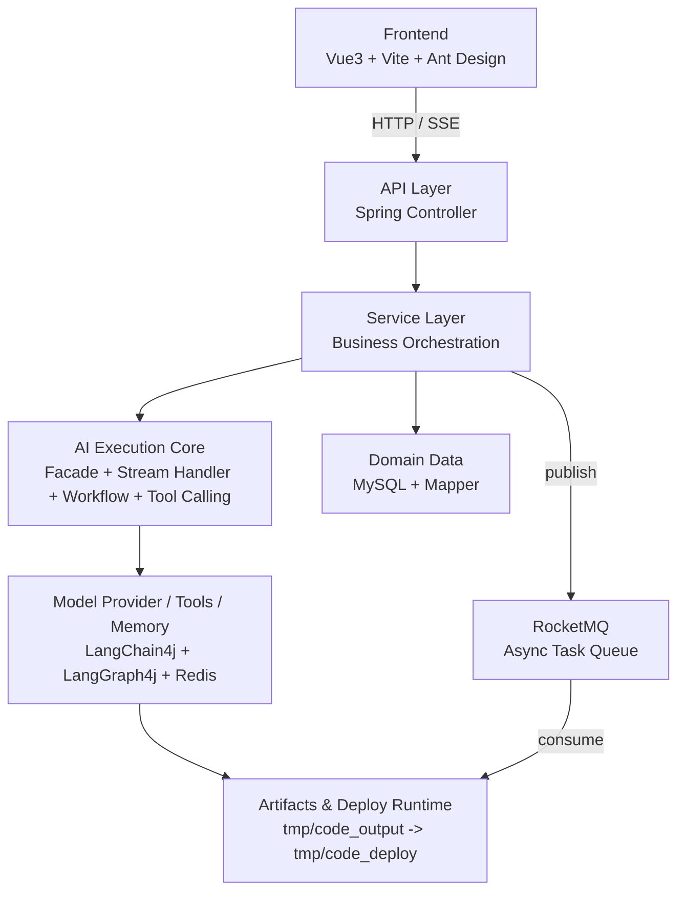
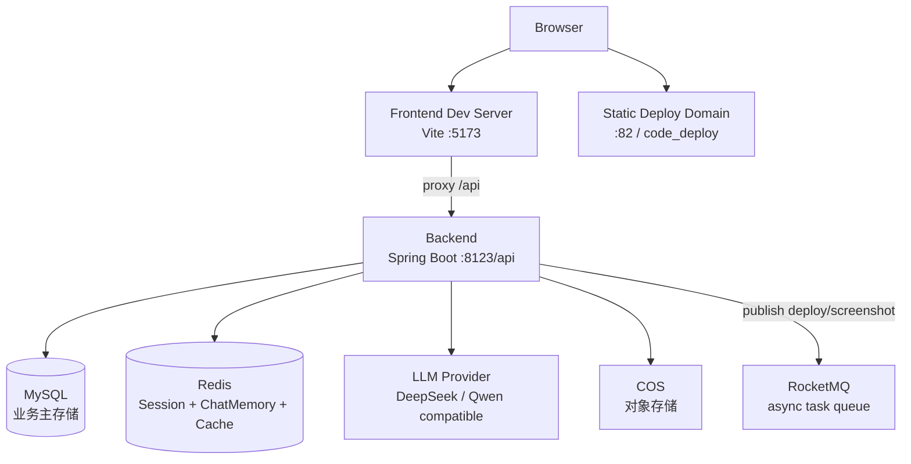
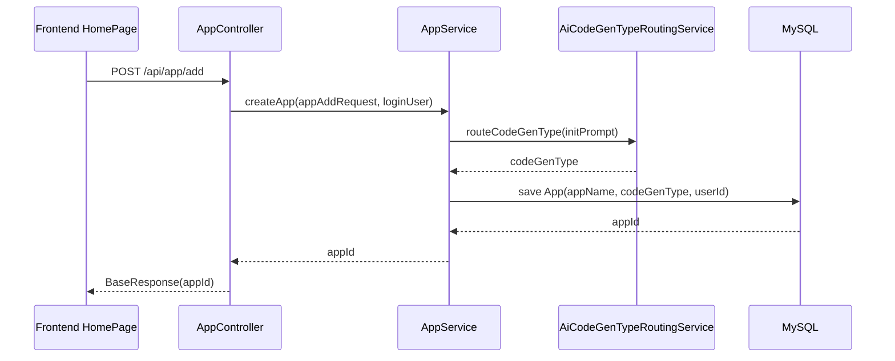
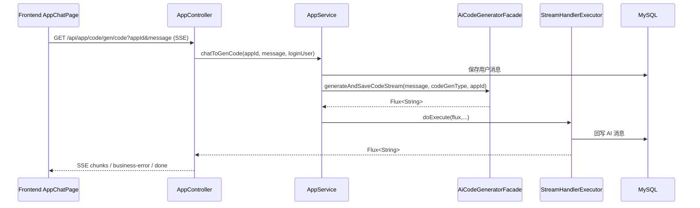
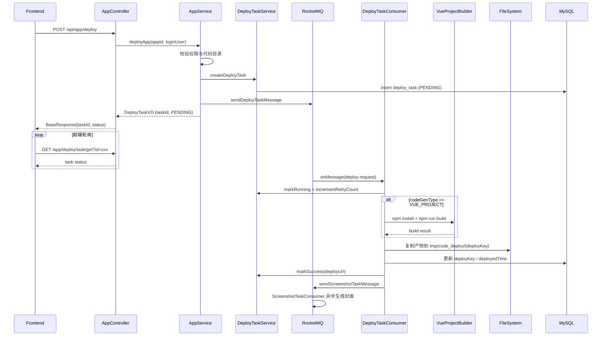

# ARCHITECTURE.md

## 1. 架构目标
Yume AI Code Mother 的架构目标是：
- 让用户通过自然语言完成代码生成、迭代编辑、预览与部署
- 将 AI 能力封装为可治理、可追溯、可扩展的工程系统
- 在单体架构下实现企业应用常见的权限、限流、缓存、异常处理能力

---

## 2. 架构全景

## 2.1 逻辑架构（分层）

## 2.2 部署架构（当前）

---

## 3. 技术选型架构说明

## 3.1 后端技术栈
- Java 21 + Spring Boot 3.5.4
- MyBatis-Flex（ORM 与查询构建）
- Redisson（分布式限流）
- Spring Session Redis（登录态）
- Spring Cache + RedisCacheManager（缓存）
- Caffeine（本地热点缓存）
- LangChain4j + LangGraph4j（AI 服务与工作流编排）
- Reactor（Flux 流式输出）
- RocketMQ（部署与截图异步任务队列）

参考依赖：`pom.xml`

## 3.2 前端技术栈
- Vue 3 + TypeScript + Vite
- Vue Router + Pinia
- Ant Design Vue
- Axios + EventSource（SSE）

参考文件：`yume-ai-code-mother-frontend/package.json`

---

## 4. 关键架构决策

## 4.1 生成协议：SSE 而非同步阻塞
**决策**：对话生成接口使用 `text/event-stream`。

**原因**：
- 生成耗时不可预测，流式可提升交互体验
- 可在过程中透传 AI 文本与工具调用事件
- 支持后端统一异常事件化返回

**实现点**：
- 后端：`controller/AppController.java:60`
- 前端：`pages/app/AppChatPage.vue` 的 `EventSource`
- 异常：`exception/GlobalExceptionHandler.java` 输出 `business-error`

## 4.2 生成编排：LangGraph4j 状态图 + 条件边/循环边
**决策**：生成流程使用工作流编排，不用单步黑盒调用。

**原因**：
- 节点职责可分离（图像采集、提示增强、路由、生成、质检、构建）
- 质检失败可自动回环再生成
- 便于观测、调试与扩展

**实现点**：
- `langgraph4j/CodeGenWorkflow.java`

## 4.3 记忆架构：Redis ChatMemory + DB 历史回放
**决策**：会话记忆双存储。

**原因**：
- Redis 支撑在线会话读写性能
- DB 保证持久化与审计能力
- 服务重启后可恢复上下文

**实现点**：
- 工厂注入：`ai/AiCodeGeneratorServiceFactory.java`
- 历史回放：`service/impl/ChatHistoryServiceImpl.java`

## 4.4 缓存架构：Caffeine（L1）+ Redis（L2）
**决策**：采用双层缓存。

**原因**：
- L1 本地缓存减少 AI Service 重建开销
- L2 Redis 支撑跨实例共享和 Spring Cache

**实现点**：
- L1：`AiCodeGeneratorServiceFactory.java`
- L2：`config/RedisCacheManagerConfig.java`

## 4.5 部署异步化：RocketMQ 任务队列
**决策**：将部署构建与截图生成从 HTTP 请求链路剥离为 RocketMQ 异步任务。

**原因**：
- 部署涉及 npm build + 文件拷贝，耗时不可控
- 截图依赖浏览器驱动，属于重资源操作
- 异步后可支持失败重试、幂等控制与独立扩容
- SSE 主生成链路保持不变，不引入 MQ 干扰实时交互

**实现点**：
- Producer：`mq/producer/AppTaskProducer.java`
- Deploy Consumer：`mq/consumer/DeployTaskConsumer.java`
- Screenshot Consumer：`mq/consumer/ScreenshotTaskConsumer.java`
- 任务状态管理：`service/impl/DeployTaskServiceImpl.java`
- 幂等锁：Redisson `RLock`

---

## 5. 核心业务链路架构

## 5.1 链路 A：创建应用

**关键输出**：
- `appId`
- `codeGenType`（由 AI 路由决定）

## 5.2 链路 B：对话生成（主链路）

**架构特性**：
- 生成与保存同链路闭环
- 前端可立即看到增量结果
- 失败以结构化事件返回

## 5.3 链路 C：异步部署与访问（RocketMQ）

**架构特性**：
- 部署不再阻塞 HTTP 请求线程
- 前端轮询任务状态直到 SUCCESS 或 FAILED
- 截图彻底解耦为独立消息任务
- 幂等保护：Redisson 锁 + 任务状态守卫

---

## 6. 数据架构

## 6.1 核心数据域
- 用户域：登录、角色、用户资料
- 应用域：应用元信息、生成类型、部署键、优先级
- 对话域：用户/AI 消息、时间线、reasoning 内容
- 任务域：部署任务状态、重试次数、消息标识（`deploy_task`）

## 6.2 存储角色分工
- MySQL：强一致业务数据（App/User/ChatHistory）
- Redis：
  - Session 存储
  - ChatMemory 存储
  - Spring Cache 缓存

## 6.3 数据一致性策略（当前实现）
- 对话先写用户消息，再发起 AI 调用
- AI 消息由流处理器在流消费过程中落库
- 应用删除时尝试删除关联对话（失败仅记录日志）

---

## 7. 安全与治理架构

## 7.1 鉴权
- `@AuthCheck` + `AuthInterceptor` 实现角色校验
- 普通用户接口通过 `getLoginUser` 获取 Session 用户

## 7.2 限流
- `@RateLimit` + `RateLimitAspect`
- 粒度：`USER` / `API` / `IP`
- 实现：Redisson `RRateLimiter`

## 7.3 异常治理
- 全局异常出口：`GlobalExceptionHandler`
- 普通接口：统一 `BaseResponse`
- SSE 接口：错误事件化输出

## 7.4 配置与密钥
- 主配置：`application.yml`
- 本地敏感配置：`application-local.yml`
- 建议密钥均采用环境变量注入

---

## 8. 性能与容量架构

## 8.1 已有机制
- 流式输出降低用户等待感知
- Caffeine 缓存减少 AI 实例构建成本
- Redis 缓存热门列表查询
- Vue 构建命令超时保护，避免无限阻塞
- RocketMQ 异步解耦部署与截图任务，避免阻塞请求线程

## 8.2 主要瓶颈点（当前单体）
1. 大模型调用并发上限
2. SSE 长连接数量
3. RocketMQ 消费者处理能力（可独立扩容）

## 8.3 扩展方向
- 生成与部署拆分服务
- 提升静态资源服务能力（CDN/对象存储直出）

---

## 9. 可观测性架构（现状与建议）

## 9.1 现状
- 以日志为主
- 部分关键流程有 info/error 日志输出

## 9.2 建议补齐
- 指标：
  - 生成成功率
  - 首 token 时间（TTFT）
  - 端到端 P95
  - SSE 断流率
  - 限流触发率
  - 部署成功率
- 链路追踪：
  - requestId / appId / roundId 贯穿
- 告警：
  - 5 分钟失败率阈值告警
  - 构建超时比例告警

---

## 10. 部署与运行架构

## 10.1 本地开发
1. 启动 MySQL、Redis
2. 执行 `sql/create_table.sql`
3. 配置 `application-local.yml`
4. 启动后端：`./mvnw spring-boot:run`
5. 启动前端：`npm run dev`

## 10.2 运行端口与路径
- Backend：`http://localhost:8123/api`
- Frontend：`http://localhost:5173`
- 前端代理：`/api -> http://localhost:8123`

---

## 11. 架构风险与改造优先级

## P0（优先）
1. 统一可观测性（指标+trace）
2. ~~生成/部署链路幂等与重试策略显式化~~（已完成：RocketMQ + Redisson 锁 + 任务状态机）
3. ~~构建任务资源隔离~~（已完成：MQ 异步解耦）

## P1（中期）
1. 部署服务独立化
2. 工作流节点插件化配置
3. 历史会话压缩与 token 成本控制

## P2（长期）
1. 微服务拆分（用户中心/应用中心/AI编排中心）
2. 全链路灰度与回滚机制

---

## 12. 关键源码索引

- 系统入口：`src/main/resources/application.yml`
- 生成接口：`src/main/java/com/yume/yuaicodemother/controller/AppController.java:60`
- 部署接口（任务提交）：`src/main/java/com/yume/yuaicodemother/controller/AppController.java:98`
- 任务状态查询：`src/main/java/com/yume/yuaicodemother/controller/AppController.java:117`
- 业务编排：`src/main/java/com/yume/yuaicodemother/service/impl/AppServiceImpl.java:78`
- AI 工厂：`src/main/java/com/yume/yuaicodemother/ai/AiCodeGeneratorServiceFactory.java:31`
- 工作流：`src/main/java/com/yume/yuaicodemother/langgraph4j/CodeGenWorkflow.java:33`
- MQ Producer：`src/main/java/com/yume/yuaicodemother/mq/producer/AppTaskProducer.java`
- MQ Deploy Consumer：`src/main/java/com/yume/yuaicodemother/mq/consumer/DeployTaskConsumer.java`
- MQ Screenshot Consumer：`src/main/java/com/yume/yuaicodemother/mq/consumer/ScreenshotTaskConsumer.java`
- 任务状态管理：`src/main/java/com/yume/yuaicodemother/service/impl/DeployTaskServiceImpl.java`
- 限流：`src/main/java/com/yume/yuaicodemother/ratelimter/aspect/RateLimitAspect.java:37`
- 异常：`src/main/java/com/yume/yuaicodemother/exception/GlobalExceptionHandler.java:22`
- 前端对话页（含轮询）：`yume-ai-code-mother-frontend/src/pages/app/AppChatPage.vue`
- 前端环境：`yume-ai-code-mother-frontend/src/config/env.ts`
