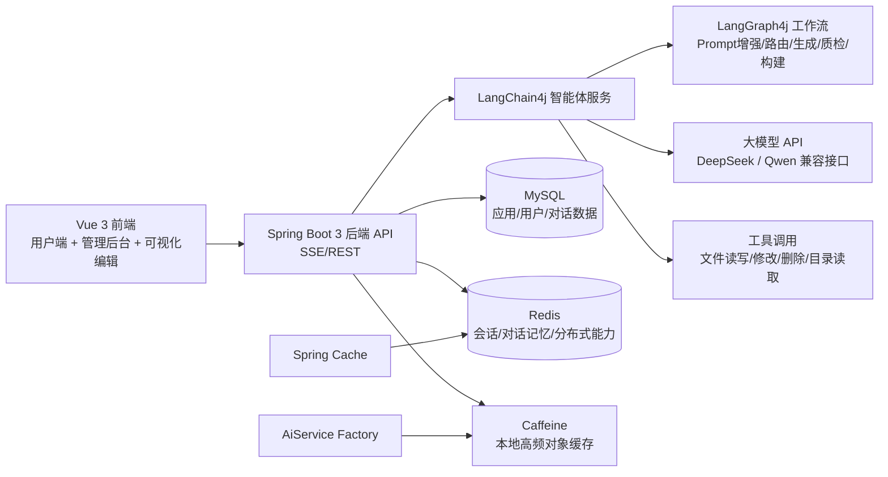

# Yume AI Code Mother

> 一个面向企业应用场景的 **AI 零代码应用生成平台**：用户用自然语言描述需求，系统自动完成代码生成、在线预览与迭代编辑，并配套企业级管理后台。

## 1. 项目简介

Yume AI Code Mother 是一个「**AI + NoCode + 工程化**」的全栈项目，当前已完整落地三大核心模块：

- **AI 代码生成模块**：输入自然语言需求，自动生成后端/前端风格代码产物，并支持流式反馈与持续迭代。
- **可视化编辑模块**：在页面预览区可直接对元素进行选中与对话式修改，形成“看见即改”的闭环。
- **企业级管理后台**：覆盖用户管理、应用管理、对话记录管理、精选应用配置与调用控制能力。

项目定位对标「美团 NoCode + AI 编程」这类生产级平台，强调：

- AI 生成可用代码（不仅是 demo）
- 生成过程可观测、可追溯、可治理
- 支持真实业务中的权限、限流、缓存与部署流程

---

## 2. 系统架构（当前实现）



> 说明：上图仅展示**当前已实现架构**。微服务拆分与监控体系在“未来优化方向”中规划。

---

## 3. 核心功能模块详解

### 3.1 AI 代码生成模块

#### 能力概览

- 自然语言需求 -> 自动路由代码生成类型（HTML / Multi-file / Vue Project）
- 基于 LangChain4j 的 AI Service + Tool Calling 机制
- 基于 LangGraph4j 的多节点工作流编排（含条件边与循环回路）
- SSE/Flux 流式输出生成进度与内容
- 多轮会话记忆（Redis 持久化 + 数据库历史回放）

#### 工作流节点（已实现）

- `image_collector`：收集页面素材（图像资源）
- `prompt_enhancer`：增强用户需求提示词
- `router`：路由生成策略
- `code_generator`：执行代码生成
- `code_quality_check`：质量检查
- `project_builder`：项目构建（按类型决定是否执行）

对应实现可见：

- `src/main/java/com/yume/yuaicodemother/langgraph4j/CodeGenWorkflow.java:33`
- `src/main/java/com/yume/yuaicodemother/controller/WorkflowSseController.java:30`
- `src/main/java/com/yume/yuaicodemother/core/AiCodeGeneratorFacade.java:77`

#### 流式响应与消息处理

- 后端通过 `Flux<String>` + `ServerSentEvent` 推送增量消息
- Vue 项目生成场景支持工具调用事件透传（请求工具 / 工具执行完成 / AI文本）
- 异常场景统一转换为 SSE 业务事件返回，前端可直接消费

相关代码：

- `src/main/java/com/yume/yuaicodemother/controller/AppController.java:60`
- `src/main/java/com/yume/yuaicodemother/core/handler/StreamHandlerExecutor.java:33`
- `src/main/java/com/yume/yuaicodemother/exception/GlobalExceptionHandler.java:50`

#### 多轮对话记忆

- 每个应用独立记忆窗口（`appId` 维度）
- Redis Chat Memory Store 持久化上下文
- 启动生成前回放数据库历史对话到 AI 记忆，提升上下文一致性

相关代码：

- `src/main/java/com/yume/yuaicodemother/ai/AiCodeGeneratorServiceFactory.java:88`
- `src/main/java/com/yume/yuaicodemother/config/RedisChatMemoryStoreConfig.java:27`
- `src/main/java/com/yume/yuaicodemother/service/impl/ChatHistoryServiceImpl.java:101`

---

### 3.2 可视化编辑器模块

#### 能力概览

- 前端基于 Vue 3 + Ant Design Vue 实现应用对话页与预览页
- 支持 iframe 预览生成结果并进入编辑模式
- 可选中页面元素，自动提取选择器、文本、路径等上下文信息
- 结合 AI 对话完成“定点修改”，减少反复描述成本

相关代码：

- `yume-ai-code-mother-frontend/src/pages/app/AppChatPage.vue:148`
- `yume-ai-code-mother-frontend/src/pages/app/AppChatPage.vue:280`
- `yume-ai-code-mother-frontend/src/pages/app/AppEditPage.vue:1`

---

### 3.3 管理后台模块

#### 已实现后台页面

- 用户管理：`/admin/userManage`
- 应用管理：`/admin/appManage`
- 对话记录管理：`/admin/chatManage`
- 精选应用与优先级管理（用于展示位/推荐位运营）

前端路由：

- `yume-ai-code-mother-frontend/src/router/index.ts:29`

后端管理接口与权限：

- 应用管理（管理员增删改查）：`src/main/java/com/yume/yuaicodemother/controller/AppController.java:297`
- 用户管理（`@AuthCheck`）：`src/main/java/com/yume/yuaicodemother/controller/UserController.java:96`
- 对话管理（管理员分页）：`src/main/java/com/yume/yuaicodemother/controller/ChatHistoryController.java:54`

---

## 4. 技术选型与设计理由

| 技术 | 选型理由 | 在本项目中的作用 |
|---|---|---|
| Spring Boot 3 + Java 21 | 生态成熟、工程化能力强、虚拟线程友好 | API 服务、业务编排、部署流程 |
| LangChain4j | Java 生态下 AI Agent 抽象完善，便于工具调用和记忆管理 | AI Service、Tool Calling、Guardrail |
| LangGraph4j | 支持图式工作流、条件路由和循环边，适合复杂生成流程 | 代码生成编排、质检回路 |
| Vue 3 + Vite + Ant Design Vue | 研发效率高、组件体系完整，适合后台 + 交互式页面 | 用户端、管理后台、可视化编辑 |
| MySQL | 结构化数据一致性和可追溯性强 | 用户/应用/对话持久化 |
| Redis | 高性能 KV、支持会话和分布式场景 | Session、Chat Memory、限流基础 |
| Caffeine | 进程内低延迟缓存，性能优于直接远程调用 | AI 服务实例本地缓存 |
| Reactor（Flux）+ SSE | 天然支持流式返回，用户体验优于同步阻塞 | AI 生成实时输出 |

### 为什么选择 LangChain4j

- 与 Spring Boot 集成自然，Java 项目落地成本低
- 能力覆盖 AI Service、Tool、Memory、Guardrail，构建企业级 AI 模块更顺滑
- 可以在统一代码体系内接入不同模型与路由策略，减少厂商绑定

### 如何处理流式响应

- 后端以 `Flux<String>` 承载增量 token / 工具事件
- Controller 层包装成 SSE，前端按事件持续渲染
- 错误链路统一走异常处理器，SSE场景也返回结构化事件，避免前端“断流无提示”

### 为什么采用 Caffeine + Redis 多级缓存

- **L1 Caffeine（本地）**：缓存热点 AI 服务实例，减少重复构建开销
- **L2 Redis（分布式）**：缓存跨实例共享数据，支撑多节点扩展
- 本地缓存负责“快”，分布式缓存负责“一致与共享”，兼顾吞吐与可扩展性

---

## 5. 工程化实践

### 5.1 统一响应与异常处理

- 统一响应体：`BaseResponse<T>`
- 统一异常出口：`GlobalExceptionHandler`
- SSE 请求的异常也会转换为结构化业务事件

对应实现：

- `src/main/java/com/yume/yuaicodemother/common/BaseResponse.java:13`
- `src/main/java/com/yume/yuaicodemother/exception/GlobalExceptionHandler.java:22`

### 5.2 权限与安全治理

- 基于 `@AuthCheck` + AOP 实现接口级角色校验
- 用户态与管理员态接口分离
- 支持下载/部署等敏感操作权限核验

对应实现：

- `src/main/java/com/yume/yuaicodemother/annotation/AuthCheck.java:11`
- `src/main/java/com/yume/yuaicodemother/aop/AuthInterceptor.java:35`

### 5.3 限流与稳定性

- 基于 Redisson 分布式限流（用户/API/IP 维度）
- AI 对话接口可配置速率，避免资源被刷爆

对应实现：

- `src/main/java/com/yume/yuaicodemother/ratelimter/aspect/RateLimitAspect.java:37`
- `src/main/java/com/yume/yuaicodemother/controller/AppController.java:61`

### 5.4 响应式编程与并发

- AI 结果采用响应式流实时推送
- 虚拟线程用于部分异步任务（如工作流执行、截图任务），降低阻塞成本

对应实现：

- `src/main/java/com/yume/yuaicodemother/langgraph4j/CodeGenWorkflow.java:105`
- `src/main/java/com/yume/yuaicodemother/service/impl/AppServiceImpl.java:190`

### 5.5 API Key 安全存储建议

当前项目已支持配置化注入（`application-local.yml`），建议进一步遵循：

- API Key 全部改为环境变量注入（如 `${OPENAI_API_KEY}`）
- 本地配置文件不提交真实密钥
- 生产环境接入密钥管理服务（KMS/Secret Manager）

---

## 6. 快速开始

### 6.1 环境要求

- Java 21
- Maven 3.9+
- Node.js 20+
- MySQL 8+
- Redis 6+

### 6.2 克隆项目

```bash
git clone <your-repo-url>
cd yume-ai-code-mother
```

### 6.3 初始化数据库

```bash
mysql -uroot -p < sql/create_table.sql
```

### 6.4 后端配置

1) 复制并调整本地配置（建议创建你自己的 profile）：

- `src/main/resources/application.yml`
- `src/main/resources/application-local.yml`

2) 必填项：

- MySQL 连接
- Redis 连接
- 大模型 API Key（DeepSeek/Qwen 兼容接口）
- COS/图像服务相关配置（如需截图与素材能力）

> 建议：使用环境变量传入密钥，避免明文写入仓库。

### 6.5 启动后端

```bash
./mvnw spring-boot:run
```

后端默认地址：`http://localhost:8123/api`

### 6.6 启动前端

```bash
cd yume-ai-code-mother-frontend
npm install
npm run dev
```

前端开发地址通常为：`http://localhost:5173`

前端代理配置见：

- `yume-ai-code-mother-frontend/vite.config.ts:15`

---

## 7. 使用示例

### 7.1 典型流程

1. 创建应用并输入初始需求（例如“生成一个企业官网首页，包含产品介绍和联系我们”）
2. AI 自动路由并流式生成代码
3. 右侧实时预览页面
4. 进入编辑模式，选中页面元素并继续用自然语言微调
5. 部署应用并下载代码

### 7.2 截图

```text

```

---

## 8. 项目亮点

- **完整闭环**：从“自然语言需求”到“代码生成、预览、编辑、部署、下载”全流程打通
- **智能体工程化**：不止调用模型，而是实现了可编排、可回路的 LangGraph4j 工作流
- **多轮上下文能力**：Redis 持久记忆 + DB 历史回放，提升连续对话质量
- **高性能实践**：Caffeine + Redis 多级缓存，兼顾低延迟与分布式扩展
- **企业后台能力**：用户、应用、对话、精选配置等运营治理模块齐全
- **个人成长价值**：以大二阶段独立完成该项目，具备 Java 后端 + AI 应用落地的系统能力

---

## 9. 未来优化方向（规划中）

### 9.1 微服务拆分

- 计划引入 **Spring Cloud Alibaba + Dubbo**
- 按领域拆分为用户中心、应用中心、AI 编排中心、素材/部署中心
- 通过网关、注册发现、配置中心提升团队协作与弹性扩展能力

### 9.2 企业级监控体系

- 引入 **Prometheus + Grafana**
- 建立 API 指标、AI 调用耗时、缓存命中率、错误率等可观测面板
- 为容量规划与性能调优提供数据支撑

---

## 10. 目录结构（简版）

```text
.
├── src/main/java/com/yume/yuaicodemother
│   ├── controller          # REST/SSE 接口层
│   ├── service             # 业务服务层
│   ├── ai                  # LangChain4j 智能体与工具
│   ├── langgraph4j         # 工作流编排与节点
│   ├── core                # 生成/解析/保存核心流程
│   ├── config              # 模型、缓存、跨域、存储等配置
│   └── ratelimter          # 限流注解与切面
├── src/main/resources
│   ├── prompt              # 系统提示词模板
│   ├── mapper              # MyBatis Flex XML
│   └── application*.yml    # 应用配置
├── sql/create_table.sql    # 数据库初始化脚本
└── yume-ai-code-mother-frontend
    ├── src/pages/app       # 应用对话/编辑页面
    ├── src/pages/admin     # 管理后台页面
    ├── src/api             # 前端 API SDK
    └── src/router          # 路由配置
```
